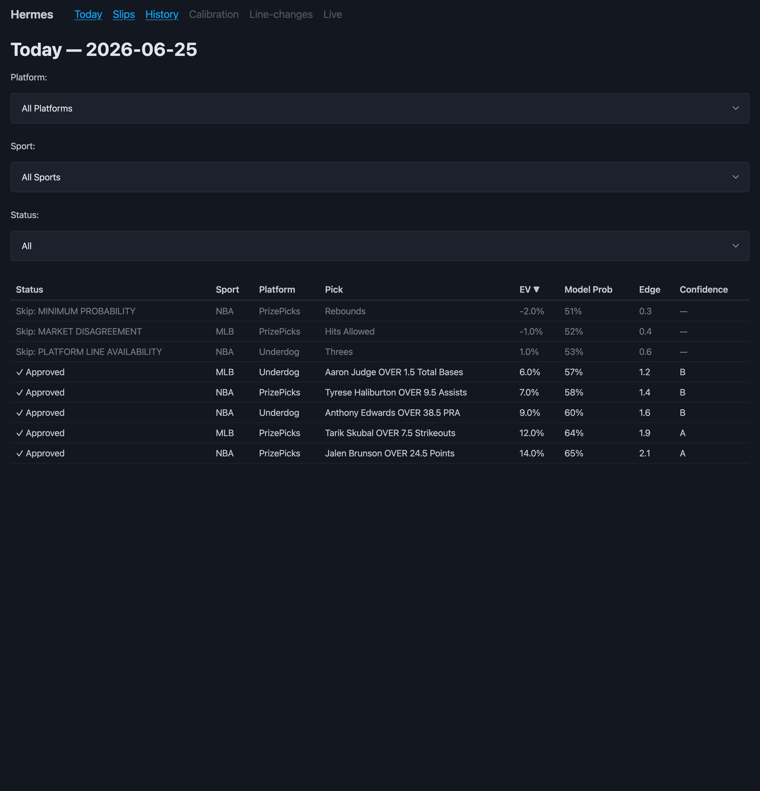
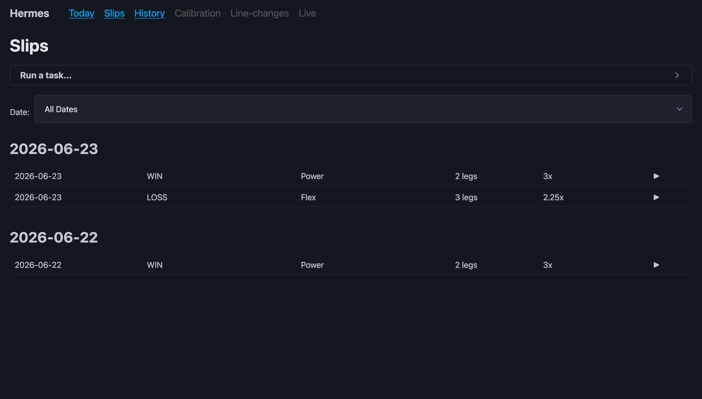
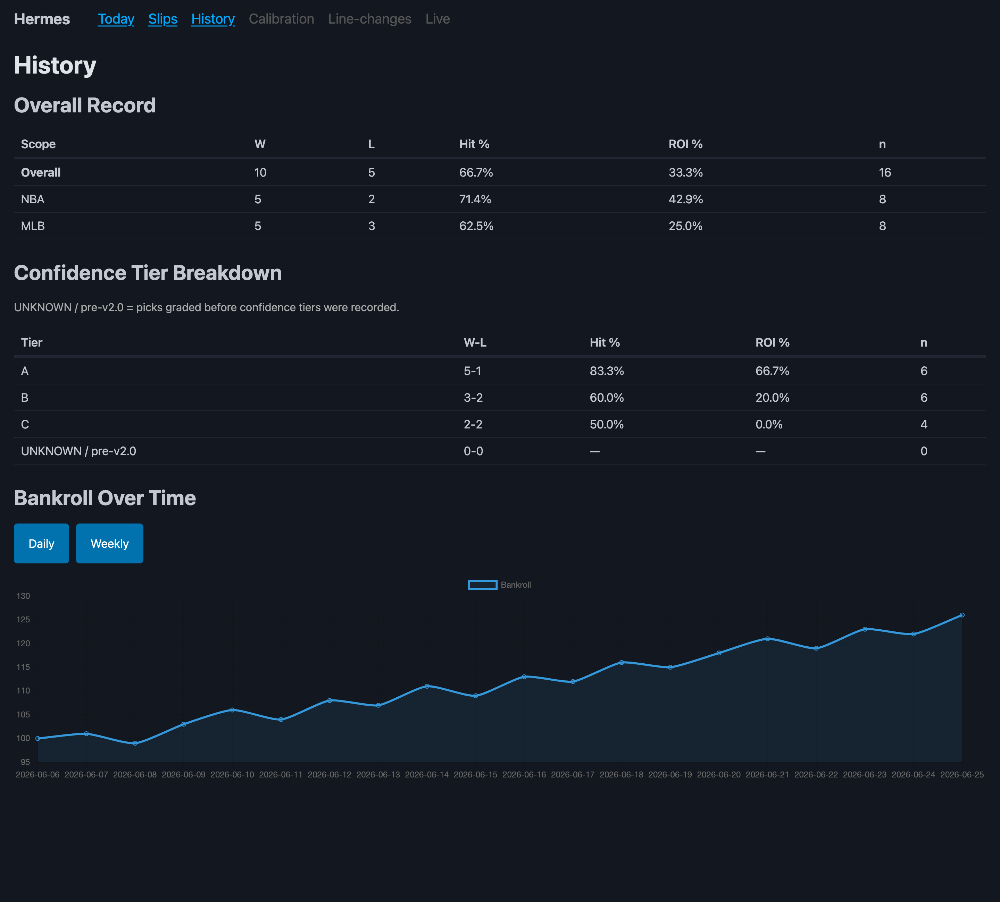

# SportsEdge — Hermes Sports Betting Automation

> An unattended, no-agent automation system that fetches DFS player props and sportsbook
> game lines for **NBA + MLB**, runs every candidate pick through a fixed gauntlet of
> **no-bet gates**, sizes and grades real slips, and surfaces everything on a localhost
> dashboard — built to run itself on a cron schedule.

<sub>Python 3.14 · `requests` + `openpyxl` · Flask dashboard · 45 modules · 70 test files · zero web service to babysit</sub>

---

> ⚠️ **About this repository.** This is a personal, real-money system. The code is public;
> the **data is not** — live bankroll, P&L, betting history, and scraped research are
> git-ignored and never published. **Every screenshot, number, player, and slip shown below
> is from a synthetic demo dataset** (`scripts/make_demo_data.py`), not real betting activity.
> Nothing here is betting advice.

---

## What it is

SportsEdge is a collection of standalone Python scripts orchestrated by a single runner
(`sports_system_runner.py`). It has **no web service and no agent loop** — each cron
invocation does one task, writes its results to per-sport Excel workbooks, pushes a Telegram
alert + Obsidian note, and exits. State lives entirely in spreadsheets and JSON, so a crash
in any one stage can never corrupt the rest.

The core flow for a sport:

```
fetch DFS props (PrizePicks + Underdog)
  → fetch Odds-API game markets (ML / spreads / totals)
  → build historical hit-rate DB (ESPN gamelogs)
  → generate projections (recency-weighted, variance-aware)
  → assemble candidate picks
  → ▶ run each through evaluate_no_bet_gates()   ← the heart of the system
  → write approved / skipped / parlays / CLV rows
  → atomic-save workbook + backup
  → dispatch Telegram + Obsidian
```

---

## Dashboard

A one-command, **loopback-only** (`127.0.0.1`) Flask dashboard gives a read view over the
day's board, slip history, and bankroll performance. Reproduce these exact screenshots with
synthetic data:

```bash
cd scripts
python3 make_demo_data.py --serve --port 8799   # builds fake data + serves the UI
```

**Today's board** — approved picks (bright) and gate-skipped picks (dimmed, with the gate that
rejected them), filterable by platform / sport / status:



**Slip history** — slips grouped by date with type (Power / Flex), legs, payout multiplier and
result; placement and notes are editable inline:



**History** — W/L record, hit-rate and ROI sliced by sport and confidence tier, plus a bankroll
curve over time:



---

## The no-bet gate gauntlet

`evaluate_no_bet_gates(pick)` is a single linear gauntlet — the first failed gate rejects the
pick and records *which* gate fired (visible as the dimmed rows on the dashboard). This is where
discipline is enforced: most candidates are intentionally rejected.

| Gate | Name | Rejects when… |
|------|------|---------------|
| G1 | Minimum Edge | model edge below threshold (prop ≥ 0.5; total implied diff ≥ 2.0) |
| G2 | Minimum Probability | model probability < 0.52 (and L10 hit-rate < 0.55) |
| G3 | Injury Clearance | OUT/DOUBTFUL; GTD held until 45 min pre-tip; MLB pitcher/lineup/weather sub-gates |
| G4 | Minutes Stability | minutes swing > 4 without a ≥ 2.0 edge |
| G5 | Platform Line Availability | primary DFS line not confirmed |
| G6 | Sample Size | sample < 8 without a ≥ 3.0 edge |
| G7 | CLV Track Record | edge type previously flagged by CLV analysis |
| G12 | Line Timing / Live Line | line not confirmed pregame (`line_timing` module) |
| G9 | Market Disagreement | line moved ≥ 0.5 against the pick; FD/DK disagreement + weak edge |

A daily exposure cap and a global NBA+MLB cap bound total risk on top of the gates.

---

## Calibration & model accuracy (M2)

A read-only **walk-forward backtest harness** measures the *production* projection model
against its own history — it reconstructs each player's state from games before game *i*, feeds
it to the real `generate_projections.build_projection`, and scores the prediction. No look-ahead,
no re-implementation.

```bash
cd scripts
python3 backtest_report.py --sport mlb     # 31,317 walk-forward MLB predictions
```

```json
{"sport": "mlb", "records": 31317, "brier": 0.2093, "ece": 0.0504,
 "pit_tail_mass": 0.1885, "report_md": "data/research/backtest/baseline_mlb_latest.md"}
```

**A finding worth highlighting.** The harness scores binary calibration with correct *push*
semantics — MLB stats are integer-valued and tie a median line ~39% of the time, and a tie is a
void (push), not a loss. Counting ties as losses manufactured a fake ECE of 0.23; voiding them
collapses it to **0.05**. The reliability table (predicted P(over) vs. what actually happened)
then shows the model is well-calibrated through the mid-range and slightly *under*-confident at
the top — the opposite of the naive read:

| predicted P(over) | n | observed over-rate | gap |
|---|---:|---:|---:|
| 0.4–0.5 | 3034 | 0.388 | 0.065 |
| 0.5–0.6 | 4937 | 0.537 | 0.011 |
| 0.6–0.7 | 4946 | 0.681 | 0.034 |
| 0.7–0.8 | 2931 | 0.872 | 0.129 |
| 0.8–0.9 | 523 | 0.958 | 0.127 |

PIT tail-mass (≈ 0.19 vs. a calibrated 0.20) confirms the model's *spread* is roughly right in
absolute terms — so the live betting overconfidence localizes to **line-relative selection
against real, shaded DFS lines**, not a defect in the projection model itself. That reframes the
tuning target. Full reports land in `data/research/backtest/`.

---

## Architecture

```
                         Hermes cron
                              │
                  sports_system_runner.py        ← orchestrator (one task per run,
                              │                     fcntl-locked, JSON_RESULT on stdout)
        ┌──────────┬─────────┼──────────┬──────────────┐
        ▼          ▼         ▼          ▼              ▼
   fetch_dfs   build_hit   generate   evaluate_     dispatch
   _props.py   _rate_db    _projec…   no_bet_gates   alerts
   (subprocess)(subprocess)(subprocess)  (inline)   (Telegram /
        │          │         │          │            Obsidian)
        └──────────┴────┬────┴──────────┘
                        ▼
              per-sport Excel workbooks   ← the only persistence (no database)
              data/{nba,mlb}/{sport}_{date}.xlsx
              data/pnl/{bankroll.json, master_pnl.xlsx}
                        ▲
                        │ read-only
                  dashboard.py (Flask, 127.0.0.1)
```

Key design choices:

- **Subprocess isolation** — the runner `subprocess.run`s the fetchers and projection stages
  rather than importing them, so a crashing fetcher can never take down the runner.
- **Excel as the database** — every sport/date is a schema-migrating workbook (`ensure_workbook`
  adds missing sheets/columns without dropping data); saves go through an atomic temp-file swap
  with a timestamped backup on every write.
- **Defensive tasks** — missing games / workbooks become explicit `SKIP` states, never
  exceptions; Telegram/Obsidian failures degrade to no-ops and never crash a task.
- **Feature-flagged data-source boundary** — PrizePicks + Underdog are first-class prop sources;
  Odds-API.io is scoped to game markets only; Dabble is comparison-only and safe-disabled.

---

## Project layout

| Path | What it is |
|------|------------|
| `scripts/sports_system_runner.py` | The orchestrator (~8,000 LOC): task dispatch, gate gauntlet, workbook writes, alerts |
| `scripts/fetch_*.py` | Platform fetchers (PrizePicks, Underdog, Dabble) + the unifying `fetch_dfs_props.py` |
| `scripts/build_hit_rate_db.py`, `generate_projections.py` | ESPN gamelog → historical hit-rate → projection subprocess stages |
| `scripts/line_timing.py`, `special_line_value.py` | Gate 12 line-timing + Demon/Goblin special-line EV |
| `scripts/slip_payouts.py`, `build_slips.py`, `grade_slips.py`, `stake_sizing.py` | Slip payout math, slip building, grading, and bankroll staking |
| `scripts/calibration.py` | Per-sport probability calibration + the feedback-loop-safe learning read |
| `scripts/backtest_*.py` | Walk-forward harness, calibration metrics, and the baseline report runner |
| `scripts/dashboard*.py` | Loopback-only Flask dashboard (views + safe write actions) |
| `scripts/workbook_io.py` | Atomic/safe workbook load & save |
| `scripts/test_*.py` | 70 test files (`unittest` / `pytest`), most pairing 1:1 with their module |
| `data/research/platform_payouts.json`, `data/nxls_schema.txt` | The two curated reference files (payout tables + the sheet/column contract) |

---

## Running it

> Requires Python **3.14** at `/usr/local/bin/python3` with `requests` + `openpyxl`, run from
> `scripts/` (sibling modules import by name). Secrets live in `~/.hermes/.env` and are never
> hardcoded.

```bash
cd scripts

# Run a single task (the cron entry point)
python3 sports_system_runner.py --task nba_daily_picks
python3 sports_system_runner.py --task mlb_daily_picks
python3 sports_system_runner.py --test-telegram      # smoke-test alerts and exit

# Tasks: nba_daily_picks · mlb_daily_picks · nba_prop_monitor · mlb_prop_monitor
#        nba_injury_monitor · mlb_injury_monitor · nba_clv_tracker · mlb_clv_tracker
#        game_completion_monitor · check_results · verify

# Calibration backtest
python3 backtest_report.py --sport mlb
python3 backtest_report.py --sport nba

# Dashboard (synthetic demo data)
python3 make_demo_data.py --serve --port 8799
```

### Tests

```bash
cd scripts
python3 -m pytest                       # discover & run everything
python3 -m pytest test_backtest_metrics.py -q
python3 test_slip_payouts.py            # most files run standalone too
```

---

## Tech stack

- **Language:** Python 3.14 (CPython, `/usr/local/bin/python3`) — stdlib-heavy
- **Dependencies:** `requests` (all HTTP), `openpyxl` (the only persistence store), `flask` (dashboard)
- **Concurrency:** single process per cron run, enforced by `fcntl.LOCK_EX`; `build_hit_rate_db`
  uses a thread pool internally for ESPN calls
- **Persistence:** Excel workbooks + JSON — no database, no migrations beyond additive schema
- **Outputs:** Telegram alerts, an Obsidian vault, and the localhost dashboard
- **Platform:** macOS (POSIX `fcntl`), unattended Hermes cron

---

## License

Personal project, shared for reference. No license granted for reuse of the betting logic.
